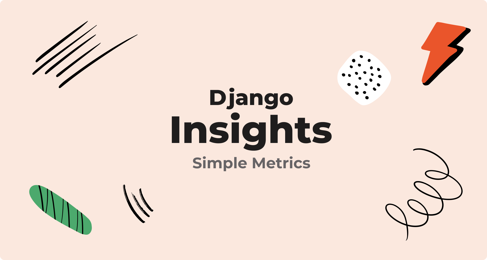

[](https://github.com/terminalkitten/django-insights/actions/workflows/main.yml)



## Features

Create insights from your app, store them in a SQLite database, these insights are written right next to your application logic.

## Installation

Installing with:

```bash
pip install 'django-insights'
```

## Usage

First create 1 or more `insights.py` file(s) in your app directory, for example:

```bash
project
└── testapp
    └── insights.py
```

In these insights files your write out any metric you would like to track. Eacht metric starts with a question and some values to store. Below is a example of the `@metrics.counter` function:

```python
# insights.py
from django_insights.metrics import metrics
from project.testapp.models import Author


@metrics.counter(question="How many authors are there?")
def count_authors() -> int:
    return Author.objects.count()

```

Migrate insights database:

```bash
$ workon myapp
$ python manage.py migrate insights --database=insights
```

## Background

I'm currently working at a small company that is in the process of renewing some parts of our product. To gain insight into the usage over different periods, we have tried a few solutions. We initially attempted to periodically generate CSV files from queries, as well as send data to a dashboard at regular intervals.

So we ended up with multiple CSV files that where spread out over multiple people. Additionally, exporting data directly from the database also posed a security risk, as it required constant movement of possible sensitive information. After several months of working with CSV files, which were often outdated and required conversion by other (paid) tools, we where looking for a better solution.

I wanted an easy-to-configure file within our various apps that would allow me to create "insights" easily, so Django Insights was born. We decided to switch to a local SQLite database which we could share on request and could by tracked by our security officer.

## Documentation

Write more about where to find documentation

## Ideas

-

## Is it any good?

[Yes.](http://news.ycombinator.com/item?id=3067434)

## License

The MIT License
